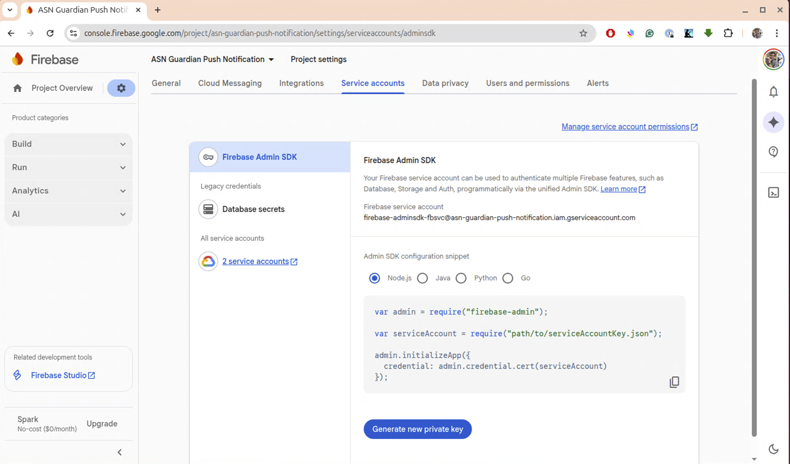
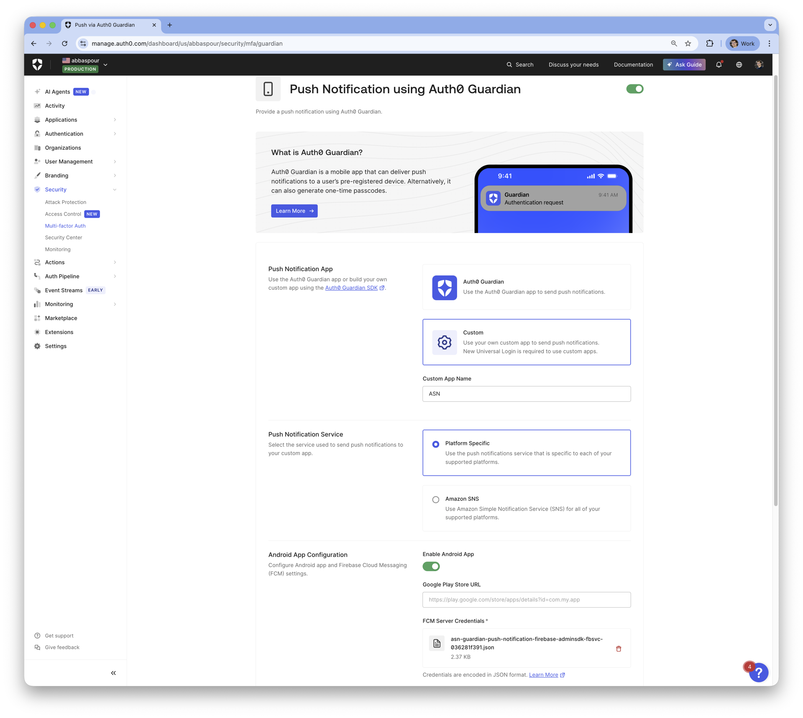
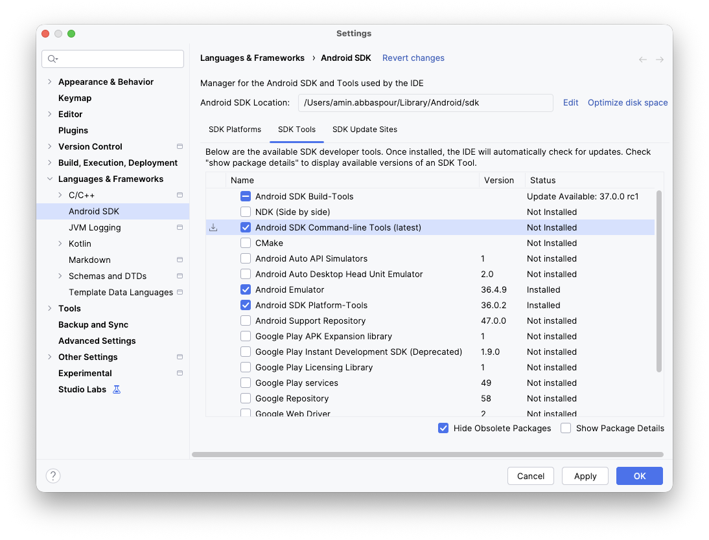

# Guardian Push Notification Android App

There is a minimal Android app in `android/` folder that receives push notifications from Guardian.

1. Go to your Android project in https://console.firebase.google.com/
2. Install Firebase Admin SDK service account then, generate and download a new Private key pair.
   
3. Download `google-services.json` from Project > Settings > General > Your apps to `/app/` folder
4. Auth0 Guardian SDK Push Notification Factor.
   Head to the Auth0 management Dashboard and enable Guardian Push notification under MFA. 
   Upload private key from step 2 to **FCM Server Credentials**.
   
5. Open in Android Studio or build from command line:
    ```shell
   gradle wrapper   # generates gradle-wrapper.jar
   ./gradlew assembleDebug
   ```
6. Install Android SDK command-line tools. Go to Android Studio > Tools > SDK Tools and select command-line tools.
   
7. Install on the device and launch the app.
   ```shell
   make list-devices  # update DEVICE in Makefile to match
   make boot
   ```
8. Run the application
   ```shell
   make install
   make run
   ```
   
9. Get your FCM token from:
    - The app UI (tap "Copy Token"), or
    - Logcat: `adb logcat -s GuardianFCM` OR `make log`
10. Use the token with enrollment:
     ```shell
    cd ..
    ./enroll-device.sh -d domain -i bash01 -n bash01 -g <fcm-token> -t <enrollment_tx_id> 
    ```
11. When Guardian sends a push, check logcat for:
    D/GuardianFCM: === GUARDIAN PUSH NOTIFICATION ===
    D/GuardianFCM: challenge: <value>
    D/GuardianFCM: txtkn: <value>

12. Resolve MFA
    ```shell
    ./resolve-transaction.sh -i bash01 -c <challenge> -t <token> ...
    ```

13. Fetch Rich Consent Data (for transactions with detailed context)
    ```shell
    # If the push notification includes a consent_id for rich authorization details:
    ./rich-consents.sh -c <consent_id> -t <txtkn> -d <domain> -i <device_id>

    # Extract specific fields using jq:
    ./rich-consents.sh -c <consent_id> -t <txtkn> -d <domain> -i <device_id> | jq '.requested_details'
    ```


# Demo Video
[](https://zoom.us/clips/share/-pcOp_IQTyCwCLCw9kaDoA)

# Related Content
* https://github.com/zamd/auth0-android-authenticator 
