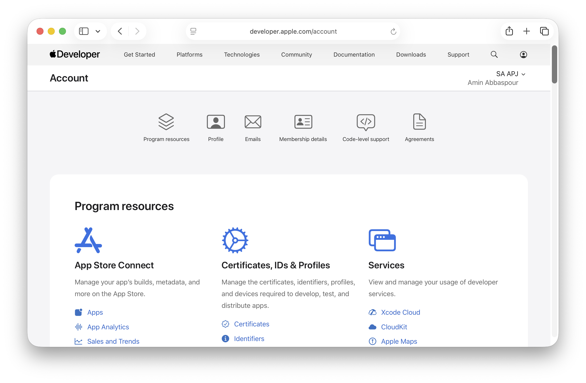
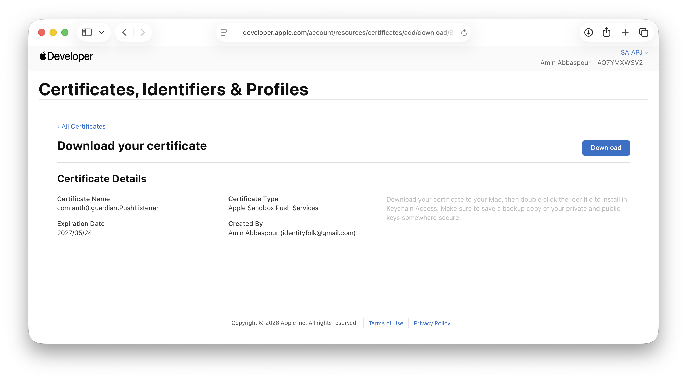
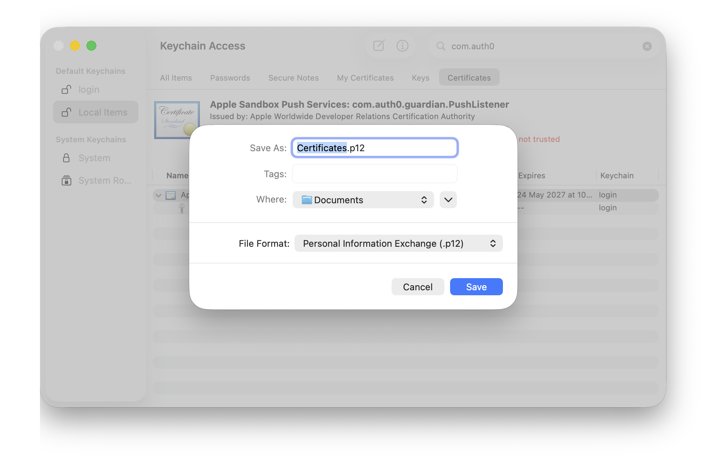
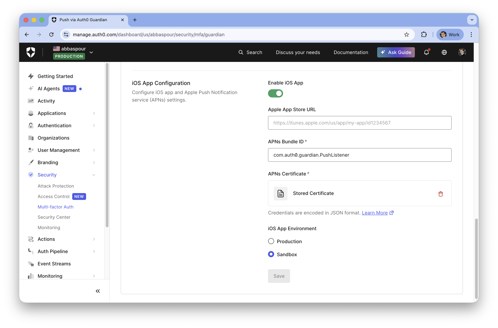
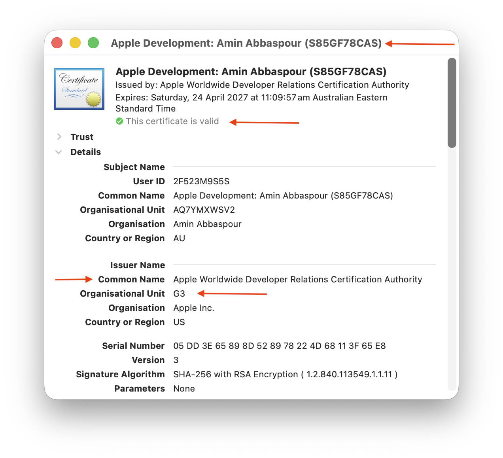

# Guardian Push Notification Apple App

To get your app Mac Application listening for notifications, you need to configure three things in the Apple Developer Portal https://developer.apple.com/account:
1. the App ID,
2. the Auth Key, and
3. your Team ID.



Here is the step-by-step checklist to get those assets.

## 1. Register the App ID (The "Identity")
APNs needs to know which specific app is allowed to receive notifications.

1. Go to Certificates, Identifiers & Profiles > Identifiers.
2. Click the **plus (+)** button to create a new Identifier.
3. Select **App IDs** and click Continue.
4. Select **App** (not App Clip) and click Continue.
5. Description: Something like "Push Listener App".
6. Bundle ID: Select Explicit and enter the exact ID you used in your `Info.plist` (e.g., `com.auth0.guardian.PushListener`).
7. Capabilities: Scroll down the list and check the box for **Push Notifications**.
8. Click Continue, then Register.


## 3. Create a Certificate Signing Request (CSR) form your Mac

1. Open Keychain Access
2. In the top menu bar, go to **Keychain Access > Certificate Assistant > Request a Certificate From a Certificate Authority...**
3. Fill in the Details:
    - User Email Address: Enter the email associated with your Apple Developer account.
    - Common Name: Enter a recognizable name (e.g., `PushListenerCSR`). This is just a label for you.
    - CA Email Address: Leave this empty.
    - Request is: Select Saved to disk.
4. Save the File: Click Continue and save the `.certSigningRequest` file to your Desktop.


## 4. Create the APN Certificate
Unlike certificates that expire every year, an Auth Key (.p8 file) never expires and can be used for all your apps.

1. Go to **Certificates, Identifiers & Profiles > Certificates**.
2. Click the **plus (+)** button.
3. Under **Services** Select **Apple Push Notification service SSL (Sandbox & Production)** and click Continue.
4. Select the **App ID** (also known as Bundle ID) (e.g. `com.auth0.guardian.PushListener`) of your app and click Continue.
5. Select **CSR from step 3** and Continue.
6. Click **Download**



## 5. Export APN Certificate to .p12 Format
1. Download the `.cer` file and double-click it to add it to your Keychain.
2. Right-click the certificate in Keychain Access and select **Export to get your Certificate.p12**.



## 6. Convert Certificate to Legacy Format
```shell
openssl pkcs12 -in Certificates.p12 -legacy -nocerts -nodes -out pk.pem -passin pass:"" 
openssl pkcs12 -in Certificates.p12 -legacy -nokeys -out cert.crt -passin pass:"" 
openssl pkcs12 -export -inkey pk.pem -in cert.crt -descert -out Certificate_3des.p12 -passout pass:"" 
rm pk.pem cert.crt
```


## 7. Find your Team ID
You need this to identify your account when sending the notification.

1. Go to the **Membership Details** section of your account.
2. Look for Team ID. It is a 10-character alphanumeric string (e.g., `9876543210`).


## 8. Enable APNS Push Notification in Auth0
1. Go to **Manage > Security > Multi-factor Auth > Push Notification Using Guardian**
2. Go to **iOS App Configuration** and **Enable iOS App**
3. **APNs Bundle ID** (e.g. `com.auth0.guardian.PushListener`)
4. **APNs Certificate** upload `Certificate_3des.p12` file from step 6.
5. iOS App Environment choose according to your Certificate Type.
6. Click Save



## 9. Apple Development Certificate - Required for Code Signing
In Apple developer website
1. Go to **Certificates, Identifiers & Profiles > Certificates**.
2. Click the **plus (+)** button.
3. Select **Apple Development** (This is the one used for testing apps locally) Click Continue.
4. Upload the `.certSigningRequest` file you saved to your desktop on step 3.
5. Click Continue, then Download the resulting `development.cer` file.


## 10. Install & Trust Development Certificate in your Keychain

1. Double-click the development.cer file you just downloaded.
2. Keychain Access will open. Ensure it is being added to the login keychain.
3. Set Trust to **"Use System Default"**
4. If Cert is not trusted, install Chain. E.g. Apple Worldwide Developer Relations Certification Authority G3
5. Apple certs are accessible from Apple PKI site https://www.apple.com/certificateauthority/


## 11. Register your Mac as a Development Device

macOS provisioning profiles require your Mac to be explicitly registered in the Developer Portal.

1. Find your Mac's Provisioning UDID:
   ```shell
   system_profiler SPHardwareDataType | grep "Provisioning UDID"
   ```
   If nothing is returned (older macOS), use Hardware UUID instead:
   ```shell
   system_profiler SPHardwareDataType | grep "Hardware UUID"
   ```
   > Use **Provisioning UDID** over Hardware UUID when both are present — the portal expects Provisioning UDID for Apple Silicon Macs.

2. Go to **Certificates, Identifiers & Profiles → Devices → +**
3. Platform: **macOS**
4. Device Name: any label (e.g. "My MacBook")
5. Device ID: paste the UDID from step 1
6. Click Continue → Register


## 12. Create and Embed a macOS Provisioning Profile

The app must have an embedded provisioning profile so macOS can verify that your certificate is authorized to use the APNS entitlement. Without it the OS will reject the app at launch.

1. Go to **Certificates, Identifiers & Profiles → Profiles → +**
2. Select **macOS App Development** → Continue
3. App ID: **com.auth0.guardian.PushListener** → Continue
4. Select your development certificate → Continue
5. Select your Mac (registered in step 11) → Continue
6. Name it (e.g. "PushListenerDev") → Generate → Download
7. Copy the downloaded profile into the app bundle:
   ```shell
   cp ~/Downloads/PushListenerDev.mobileprovision \
     apns/PushListenerApp.app/Contents/embedded.provisionprofile
   ```


## 13. Sign Sample Code
1. Check Developer Cert is Trusted
2. Obtain your **Member ID**
3. Update `Makefile` in `apns/` folder with your `NAME` and `MEMBER_ID`
4. Run `make compile && make sign`




## 14. Notification Permission
Go to Apple's **System Settings > Notifications > Allow notifications** for PushListener app.


