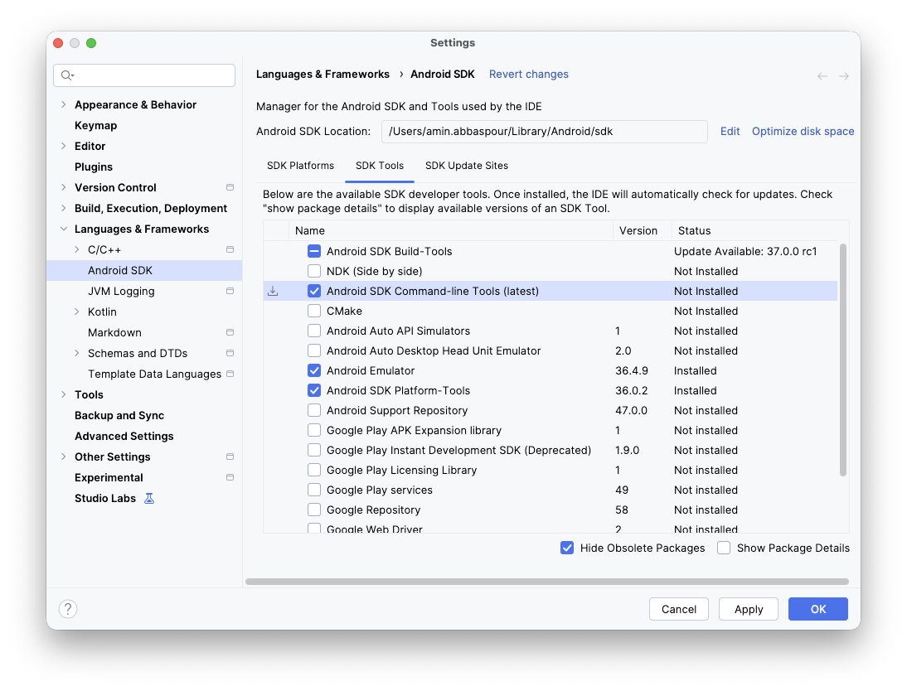
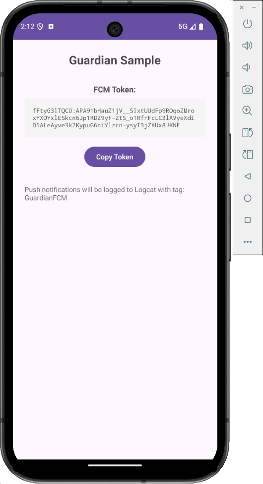
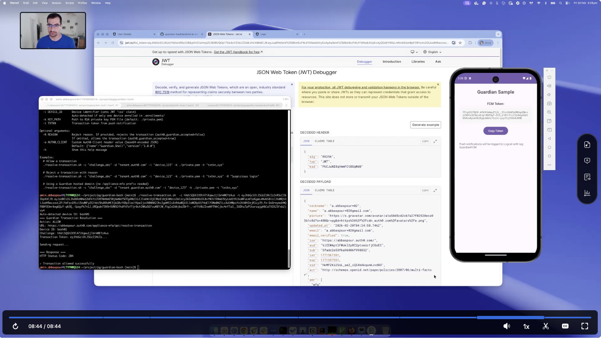

# Auth0 Guardian Bash Scripts

This project is a set of bash scripts that interact with Auth0 Guardian API.

- Enroll/unenroll a device to Guardian push notifications
- Receives push notifications from Guardian
- Resolves (accept/reject) transaction from Guardian

# Guardian API Summary

## Summary Table

| Functionality      | HTTP Method | Endpoints                               | Authentication | Shell Script             |
|--------------------|-------------|-----------------------------------------|----------------|--------------------------|
| Enroll Device      | POST        | /appliance-mfa/api/enroll               | Ticket         | ./enroll-device.sh       |
| Allow/Reject MFA   | POST        | /appliance-mfa/api/resolve-transaction  | Bearer Token   | ./resolve-transaction.sh |
| Delete Device      | DELETE      | /appliance-mfa/api/device-accounts/{id} | JWT Bearer     | ./unenroll-device.sh     |
| Update Device      | PATCH       | /appliance-mfa/api/device-accounts/{id} | JWT Bearer     | ./update-device.sh       |
| Fetch Rich Consent | GET         | /rich-consents/{consent_id}             | DPoP + Bearer  | ./rich-consents.sh       |

## Methods

### `POST /appliance-mfa/api/enroll`

**Description:** Enrolls a device to receive Guardian push notifications.

**Authentication:** `Ticket id="<ENROLLMENT_TICKET_FROM_QR_CODE>"`

**Request:**

Headers:
```
Authorization: Ticket id="<enrollment_ticket>"
Auth0-Client: eyJuYW1lIjoiR3VhcmRpYW4uU2hlbGwiLCJ2ZXJzaW9uIjoiMS4wLjAifQ
Content-Type: application/json
```

Body:
```json
{
  "identifier": "device-001",
  "name": "My Android Device",
  "push_credentials": {
    "service": "GCM",
    "token": "fcm_token_xyz789..."
  },
  "public_key": {
    "kty": "RSA",
    "alg": "RS256",
    "use": "sig",
    "e": "AQAB",
    "n": "xGOr-H7A-qFxQ7..."
  }
}
```

**Response:**

Success (HTTP 200/201):
```json
{
  "id": "dev_ztaIUOx5Z3zeRimt",
  "url": "https://TENANT.auth0.com",
  "issuer": "TENANT",
  "user_id": "auth0|5fadc2e53f6a96006f998832",
  "token": "191YCA4wYITisPHHSGrgZOiJvADmIA...",
  "totp": {
    "secret": "GRXC4KC5KUYWCZDDLVFFIWB6IB2UKLBF",
    "algorithm": "SHA1",
    "digits": 6,
    "period": 30
  }
}
```

Errors:
- HTTP 401: Invalid or expired enrollment ticket
- HTTP 409: Device already enrolled (conflict)
- HTTP 400: Invalid request parameters

**Notes:**
- Guardian-hosted domains (*.guardian.*.auth0.com): Use `/api/enroll`
- Custom domains: Use `/appliance-mfa/api/enroll`
- Public key must be RSA in JWK format with base64url-encoded exponent (e) and modulus (n)
- The enrollment ticket comes from Auth0 QR code (`enrollment_tx_id` parameter) for interactive logins
- Response `token` and `id` are saved to `.enrollments/{device_id}.json` for later use
- Auth0-Client header: Base64url-encoded `{"name":"Guardian.Shell","version":"1.0.0"}`

---

### `POST /appliance-mfa/api/resolve-transaction`

**Description:** Resolves (allows or rejects) a Guardian MFA transaction.

**Authentication:** `Bearer <TRANSACTION_TOKEN_FROM_PUSH>`

**Request:**

Headers:
```
Authorization: Bearer <transaction_token>
Auth0-Client: eyJuYW1lIjoiR3VhcmRpYW4uU2hlbGwiLCJ2ZXJzaW9uIjoiMS4wLjAifQ
Content-Type: application/json
```

Body:
```json
{
  "challenge_response": "<SIGNED_JWT>"
}
```

**JWT Structure for challenge_response:**

Header:
```json
{
  "alg": "RS256",
  "typ": "JWT"
}
```

Payload (Allow transaction):
```json
{
  "iat": 1708473824,
  "exp": 1708473854,
  "aud": "https://TENANT.auth0.com/appliance-mfa/api/resolve-transaction",
  "iss": "device-001",
  "sub": "challenge_value_from_push",
  "auth0_guardian_method": "push",
  "auth0_guardian_accepted": true
}
```

Payload (Reject transaction with reason):
```json
{
  "iat": 1708473824,
  "exp": 1708473854,
  "aud": "https://TENANT.auth0.com/appliance-mfa/api/resolve-transaction",
  "iss": "device-001",
  "sub": "challenge_value_from_push",
  "auth0_guardian_method": "push",
  "auth0_guardian_accepted": false,
  "auth0_guardian_reason": "Suspicious login attempt"
}
```

**Response:**

Success: HTTP 204 (No Content) or HTTP 200 with empty body

Errors:
- HTTP 401: Invalid transaction token
- HTTP 400: Invalid JWT or expired challenge

**Notes:**
- JWT must be signed with device's private RSA key using RS256 algorithm
- JWT format: `base64url(header).base64url(payload).base64url(signature)`
- JWT expires 30 seconds after creation (short-lived)
- `iat`: Current Unix timestamp
- `exp`: iat + 30 seconds
- `aud`: Full URL to the resolve-transaction endpoint
- `iss`: Device identifier (issuer is the device)
- `sub`: Challenge value from push notification
- `auth0_guardian_reason`: Optional, only included when rejecting
- Guardian-hosted domains use `/api/resolve-transaction`, custom domains use `/appliance-mfa/api/resolve-transaction`

---

### `DELETE /appliance-mfa/api/device-accounts/{id}`

**Description:** Unenrolls a device from Guardian push notifications.

**Authentication:** `Bearer <DEVICE_TOKEN_FROM_ENROLLMENT>`

**Request:**

Headers:
```
Authorization: Bearer <device_token>
Auth0-Client: eyJuYW1lIjoiR3VhcmRpYW4uU2hlbGwiLCJ2ZXJzaW9uIjoiMS4wLjAifQ
```

Body: None (DELETE request)

**URL Parameters:**
- `{id}`: Enrollment ID (e.g., `dev_ztaIUOx5Z3zeRimt`)

**Example:**
```
DELETE https://TENANT.auth0.com/appliance-mfa/api/device-accounts/dev_ztaIUOx5Z3zeRimt
```

**Response:**

Success: HTTP 204 (No Content)

Success (idempotent): HTTP 404 (Device already deleted)

Errors:
- HTTP 401: Invalid device token

**Notes:**
- Device token comes from enrollment response (saved in `.enrollments/{device_id}.json`)
- Enrollment ID is the `id` field from enrollment response
- HTTP 404 is treated as success (idempotent operation)
- Script automatically removes `.enrollments/{device_id}.json` file on success
- Guardian-hosted domains use `/api/device-accounts/{id}`, custom domains use `/appliance-mfa/api/device-accounts/{id}`

---

### `PATCH /appliance-mfa/api/device-accounts/{id}`

**Description:** Updates device information (identifier, name, or push credentials).

**Authentication:** `Bearer <DEVICE_TOKEN_FROM_ENROLLMENT>`

**Request:**

Headers:
```
Authorization: Bearer <device_token>
Auth0-Client: eyJuYW1lIjoiR3VhcmRpYW4uU2hlbGwiLCJ2ZXJzaW9uIjoiMS4wLjAifQ
Content-Type: application/json
```

Body (all fields optional):
```json
{
  "identifier": "new-device-identifier",
  "name": "Updated Device Name",
  "push_credentials": {
    "service": "GCM",
    "token": "new_fcm_token_xyz789..."
  }
}
```

**URL Parameters:**
- `{id}`: Enrollment ID (e.g., `dev_ztaIUOx5Z3zeRimt`)

**Response:**

Success: HTTP 200 with updated device account object

Errors:
- HTTP 401: Invalid device token
- HTTP 404: Device not found

**Notes:**
- All fields in request body are optional - only include fields you want to update
- Same authentication as DELETE (uses device token from enrollment)
- Useful for updating push notification token when it changes
- Guardian-hosted domains use `/api/device-accounts/{id}`, custom domains use `/appliance-mfa/api/device-accounts/{id}`

---

### `GET /rich-consents/{consent_id}`

**Description:** Fetches rich consent data for detailed MFA context (DPoP-authenticated endpoint).

**Authentication:** `MFA-DPoP <TRANSACTION_TOKEN>` with DPoP proof JWT

**Request:**

Headers:
```
Authorization: MFA-DPoP <transaction_token>
MFA-DPoP: <DPOP_PROOF_JWT>
Auth0-Client: eyJuYW1lIjoiR3VhcmRpYW4uU2hlbGwiLCJ2ZXJzaW9uIjoiMS4wLjAifQ
```

Body: None (GET request)

**URL Parameters:**
- `{consent_id}`: Consent identifier from push notification

**DPoP Proof JWT Structure:**

Header:
```json
{
  "alg": "RS256",
  "typ": "dpop+jwt",
  "jwk": {
    "kty": "RSA",
    "n": "xGOr-H7A-qFxQ7...",
    "e": "AQAB",
    "alg": "RS256",
    "use": "sig"
  }
}
```

Payload:
```json
{
  "htu": "https://TENANT.auth0.com/rich-consents/consent_abc123",
  "htm": "GET",
  "ath": "base64url_sha256_hash_of_transaction_token",
  "jti": "550e8400-e29b-41d4-a716-446655440000",
  "iat": 1708473824
}
```

**Response:**

Success: HTTP 200 with rich consent data

**Notes:**
- Uses DPoP (Demonstrating Proof-of-Possession) authentication
- Authorization header uses `MFA-DPoP` scheme (not `Bearer`)
- DPoP proof JWT includes the public key in header (`jwk` field)
- `htu`: Full URL to this exact endpoint (HTTP URI)
- `htm`: HTTP method ("GET")
- `ath`: Base64url-encoded SHA-256 hash of the transaction token
- `jti`: Unique JWT ID (UUID)
- `iat`: Current Unix timestamp
- DPoP proof must be signed with device's private key
- Rich consent domain handling: Strips `.guardian` subdomain and `/appliance-mfa` prefix

# Boostrap

`tf/` folder contains Terraform scripts to deploy AWS SNS and Auth0 resources.

# Guardian Push Notification App

There is a minimal Android app in `android/` folder that receives push notifications from Guardian.

1. Copy your google-services.json to android/app/
2. Open in Android Studio or build from command line:
    ```shell
   cd android
   gradle wrapper   # generates gradle-wrapper.jar
   ./gradlew assembleDebug
   ```
3. Install Android SDK command-line tools. Go to Android Studio > Tools > SDK Tools and select command-line tools.
   
4. Install on the device and launch the app.
   ```shell
   make list-devices  # update DEVICE in Makefile to match
   make boot
   ```
5. Run the application
   ```shell
   make install
   make run
   ```
   
5. Get your FCM token from:
    - The app UI (tap "Copy Token"), or
    - Logcat: `adb logcat -s GuardianFCM` OR `make log`
6. Use the token with enrollment:
    ```shell
   cd ..
   ./enroll-device.sh -g <fcm-token> -c <challenge> ...
   ```
7. When Guardian sends a push, check logcat for:
   D/GuardianFCM: === GUARDIAN PUSH NOTIFICATION ===
   D/GuardianFCM: challenge: <value>
   D/GuardianFCM: txtkn: <value>

8. Resolve MFA
   ```shell
   ./resolve-transaction.sh -c <challenge> -t <token> ... 
   ```
   
# Demo Video
[](https://zoom.us/clips/share/-pcOp_IQTyCwCLCw9kaDoA)