# Auth0 Guardian Bash Scripts

This project is a set of bash scripts that interact with Auth0 Guardian API.

- Enroll/unenroll a device to Guardian push notifications
- Receives push notifications from Guardian
- Resolves (accept/reject) transaction from Guardian

# Guardian API Summary

## Summary Table

| Functionality      | HTTP Method | Endpoints                               | Authentication | Shell Script             |
|--------------------|-------------|-----------------------------------------|----------------|--------------------------|
| Enroll Device      | POST        | /appliance-mfa/api/enroll               | Ticket         | ./enroll-device.sh       |
| Allow/Reject MFA   | POST        | /appliance-mfa/api/resolve-transaction  | Bearer Token   | ./resolve-transaction.sh |
| Delete Device      | DELETE      | /appliance-mfa/api/device-accounts/{id} | JWT Bearer     | ./unenroll-device.sh     |
| Update Device      | PATCH       | /appliance-mfa/api/device-accounts/{id} | JWT Bearer     | ./update-device.sh       |
| Fetch Rich Consent | GET         | /rich-consents/{consent_id}             | DPoP + Bearer  | ./rich-consents.sh       |

## Methods

### `POST /appliance-mfa/api/enroll`

**Description:** Enrolls a device to receive Guardian push notifications.

**Authentication:** `Ticket id="<ENROLLMENT_TICKET_FROM_QR_CODE>"`

**Request:**

Headers:
```
Authorization: Ticket id="<enrollment_ticket>"
Auth0-Client: eyJuYW1lIjoiR3VhcmRpYW4uU2hlbGwiLCJ2ZXJzaW9uIjoiMS4wLjAifQ
Content-Type: application/json
```

Body:
`public_key` can be either RSA (RS256) or EC (ES256).

```json
{
  "identifier": "device-001",
  "name": "My Android Device",
  "push_credentials": {
    "service": "GCM",
    "token": "fcm_token_xyz789..."
  },
  "public_key": {
    "kty": "RSA",
    "alg": "RS256",
    "use": "sig",
    "e": "AQAB",
    "n": "xGOr-H7A-qFxQ7..."
  },
  "public_key":{
    "kty": "EC",
    "x": "EXjF9XNdUgbU7ywbv7WyxhzDN0nePTM7_AzSYZ7KE4k",
    "y": "yLc6c2_KVsToNoQtmdcKM5hs4ViwwvIXLWFtGZWMOlI",
    "crv": "P-256",
    "alg": "ES256",
    "use": "sig"
  }  
}
```

**Response:**

Success (HTTP 200/201):
```json
{
  "id": "dev_ztaIUOx5Z3zeRimt",
  "url": "https://TENANT.auth0.com",
  "issuer": "TENANT",
  "user_id": "auth0|5fadc2e53f6a96006f998832",
  "token": "191YCA4wYITisPHHSGrgZOiJvADmIA...",
  "totp": {
    "secret": "GRXC4KC5KUYWCZDDLVFFIWB6IB2UKLBF",
    "algorithm": "SHA1",
    "digits": 6,
    "period": 30
  }
}
```

Errors:
- HTTP 401: Invalid or expired enrollment ticket
- HTTP 409: Device already enrolled (conflict)
- HTTP 400: Invalid request parameters

**Notes:**
- Guardian-hosted domains (*.guardian.*.auth0.com): Use `/api/enroll`
- Custom domains: Use `/appliance-mfa/api/enroll`
- Public key must be RSA in JWK format with base64url-encoded exponent (e) and modulus (n)
- The enrollment ticket comes from Auth0 QR code (`enrollment_tx_id` parameter) for interactive logins
- Response `token` and `id` are saved to `.enrollments/{device_id}.json` for later use
- Auth0-Client header: Base64url-encoded `{"name":"Guardian.Shell","version":"1.0.0"}`

---

### `POST /appliance-mfa/api/resolve-transaction`

**Description:** Resolves (allows or rejects) a Guardian MFA transaction.

**Authentication:** `Bearer <TRANSACTION_TOKEN_FROM_PUSH>`

**Request:**

Headers:
```
Authorization: Bearer <transaction_token>
Auth0-Client: eyJuYW1lIjoiR3VhcmRpYW4uU2hlbGwiLCJ2ZXJzaW9uIjoiMS4wLjAifQ
Content-Type: application/json
```

Body:
```json
{
  "challenge_response": "<SIGNED_JWT>"
}
```

**JWT Structure for challenge_response:**

Header:
```json
{
  "alg": "RS256|ES256",
  "typ": "JWT"
}
```

Payload (Allow transaction):
```json
{
  "iat": 1708473824,
  "exp": 1708473854,
  "aud": "https://TENANT.auth0.com/appliance-mfa/api/resolve-transaction",
  "iss": "device-001",
  "sub": "challenge_value_from_push",
  "auth0_guardian_method": "push",
  "auth0_guardian_accepted": true
}
```

Payload (Reject transaction with reason):
```json
{
  "iat": 1708473824,
  "exp": 1708473854,
  "aud": "https://TENANT.auth0.com/appliance-mfa/api/resolve-transaction",
  "iss": "device-001",
  "sub": "challenge_value_from_push",
  "auth0_guardian_method": "push",
  "auth0_guardian_accepted": false,
  "auth0_guardian_reason": "Suspicious login attempt"
}
```

**Response:**

Success: HTTP 204 (No Content) or HTTP 200 with empty body

Errors:
- HTTP 401: Invalid transaction token
- HTTP 400: Invalid JWT or expired challenge

**Notes:**
- JWT must be signed with device's private RSA key using RS256 algorithm
- JWT format: `base64url(header).base64url(payload).base64url(signature)`
- JWT expires 30 seconds after creation (short-lived)
- `iat`: Current Unix timestamp
- `exp`: iat + 30 seconds
- `aud`: Full URL to the resolve-transaction endpoint
- `iss`: Device identifier (issuer is the device)
- `sub`: Challenge value from push notification
- `auth0_guardian_reason`: Optional, only included when rejecting
- Guardian-hosted domains use `/api/resolve-transaction`, custom domains use `/appliance-mfa/api/resolve-transaction`

---

### `DELETE /appliance-mfa/api/device-accounts/{id}`

**Description:** Unenrolls a device from Guardian push notifications.

**Authentication:** `Bearer <DEVICE_TOKEN_FROM_ENROLLMENT>`

**Request:**

Headers:
```
Authorization: Bearer <device_token>
Auth0-Client: eyJuYW1lIjoiR3VhcmRpYW4uU2hlbGwiLCJ2ZXJzaW9uIjoiMS4wLjAifQ
```

Body: None (DELETE request)

**URL Parameters:**
- `{id}`: Enrollment ID (e.g., `dev_ztaIUOx5Z3zeRimt`)

**Example:**
```
DELETE https://TENANT.auth0.com/appliance-mfa/api/device-accounts/dev_ztaIUOx5Z3zeRimt
```

**Response:**

Success: HTTP 204 (No Content)

Success (idempotent): HTTP 404 (Device already deleted)

Errors:
- HTTP 401: Invalid device token

**Notes:**
- Device token comes from enrollment response (saved in `.enrollments/{device_id}.json`)
- Enrollment ID is the `id` field from enrollment response
- HTTP 404 is treated as success (idempotent operation)
- Script automatically removes `.enrollments/{device_id}.json` file on success
- Guardian-hosted domains use `/api/device-accounts/{id}`, custom domains use `/appliance-mfa/api/device-accounts/{id}`

---

### `PATCH /appliance-mfa/api/device-accounts/{id}`

**Description:** Updates device information (identifier, name, or push credentials).

**Authentication:** `Bearer <DEVICE_TOKEN_FROM_ENROLLMENT>`

**Request:**

Headers:
```
Authorization: Bearer <device_token>
Auth0-Client: eyJuYW1lIjoiR3VhcmRpYW4uU2hlbGwiLCJ2ZXJzaW9uIjoiMS4wLjAifQ
Content-Type: application/json
```

Body (all fields optional):
```json
{
  "identifier": "new-device-identifier",
  "name": "Updated Device Name",
  "push_credentials": {
    "service": "GCM",
    "token": "new_fcm_token_xyz789..."
  }
}
```

**URL Parameters:**
- `{id}`: Enrollment ID (e.g., `dev_ztaIUOx5Z3zeRimt`)

**Response:**

Success: HTTP 200 with updated device account object

Errors:
- HTTP 401: Invalid device token
- HTTP 404: Device not found

**Notes:**
- All fields in request body are optional - only include fields you want to update
- Same authentication as DELETE (uses device token from enrollment)
- Useful for updating push notification token when it changes
- Guardian-hosted domains use `/api/device-accounts/{id}`, custom domains use `/appliance-mfa/api/device-accounts/{id}`

---

### `GET /rich-consents/{consent_id}`

**Description:** Fetches rich consent data for detailed MFA context (DPoP-authenticated endpoint).

**Authentication:** `MFA-DPoP <TRANSACTION_TOKEN>` with DPoP proof JWT

**Request:**

Headers:
```
Authorization: MFA-DPoP <transaction_token>
MFA-DPoP: <DPOP_PROOF_JWT>
Auth0-Client: eyJuYW1lIjoiR3VhcmRpYW4uU2hlbGwiLCJ2ZXJzaW9uIjoiMS4wLjAifQ
```

Body: None (GET request)

**URL Parameters:**
- `{consent_id}`: Consent identifier from push notification

**DPoP Proof JWT Structure:**

Header:
```json
{
  "alg": "RS256",
  "typ": "dpop+jwt",
  "jwk": {
    "kty": "RSA",
    "n": "xGOr-H7A-qFxQ7...",
    "e": "AQAB",
    "alg": "RS256",
    "use": "sig"
  }
}
```

Payload:
```json
{
  "htu": "https://TENANT.auth0.com/rich-consents/consent_abc123",
  "htm": "GET",
  "ath": "base64url_sha256_hash_of_transaction_token",
  "jti": "550e8400-e29b-41d4-a716-446655440000",
  "iat": 1708473824
}
```

**Response:**

Success: HTTP 200 with rich consent data

**Notes:**
- Uses DPoP (Demonstrating Proof-of-Possession) authentication
- Authorization header uses `MFA-DPoP` scheme (not `Bearer`)
- DPoP proof JWT includes the public key in header (`jwk` field)
- `htu`: Full URL to this exact endpoint (HTTP URI)
- `htm`: HTTP method ("GET")
- `ath`: Base64url-encoded SHA-256 hash of the transaction token
- `jti`: Unique JWT ID (UUID)
- `iat`: Current Unix timestamp
- DPoP proof must be signed with device's private key
- Rich consent domain handling: Strips `.guardian` subdomain and `/appliance-mfa` prefix

# Utility Scripts

## pem-to-jwk.sh

Standalone utility to convert RSA PEM files (public or private keys) to JWK (JSON Web Key) format. This utility is used internally by `enroll-device.sh` and `rich-consents.sh` for Guardian enrollment.

**Usage:**
```bash
./pem-to-jwk.js <pem-file>       # Convert from file
./pem-to-jwk.js -                # Read from stdin
cat public.pem | ./pem-to-jwk.js # Pipe from stdin
```

**Examples:**
```bash
# Convert public key to JWK
./pem-to-jwk.js public.pem

# Extract modulus (n) and exponent (e)
./pem-to-jwk.js public.pem | jq '.n'
./pem-to-jwk.js public.pem | jq -r '.n, .e'

# Use in pipeline
cat public.pem | ./pem-to-jwk.js | jq '.'
```

**Output:**
```json
{
  "kty": "RSA",
  "alg": "RS256",
  "use": "sig",
  "e": "AQAB",
  "n": "o99mR0tHeOBdbT9..."
}
```

**Requirements:**
- `openssl` - RSA key operations
- `jq` - JSON generation
- `xxd` - Hex-to-binary conversion

# Boostrap

`tf/` folder contains Terraform scripts to deploy AWS SNS and Auth0 resources.

# Guardian Push Notification Android App

There is a minimal Android app in `android/` folder that receives push notifications from Guardian.

1. Go to your Android project in https://console.firebase.google.com/
2. Install Firebase Admin SDK service account
3. Download `google-services.json` from Project > Settings > General > Your apps to android/app/ folder 
4. Open in Android Studio or build from command line:
    ```shell
   cd android
   gradle wrapper   # generates gradle-wrapper.jar
   ./gradlew assembleDebug
   ```
5. Install Android SDK command-line tools. Go to Android Studio > Tools > SDK Tools and select command-line tools.
   
6. Install on the device and launch the app.
   ```shell
   make list-devices  # update DEVICE in Makefile to match
   make boot
   ```
7. Run the application
   ```shell
   make install
   make run
   ```
   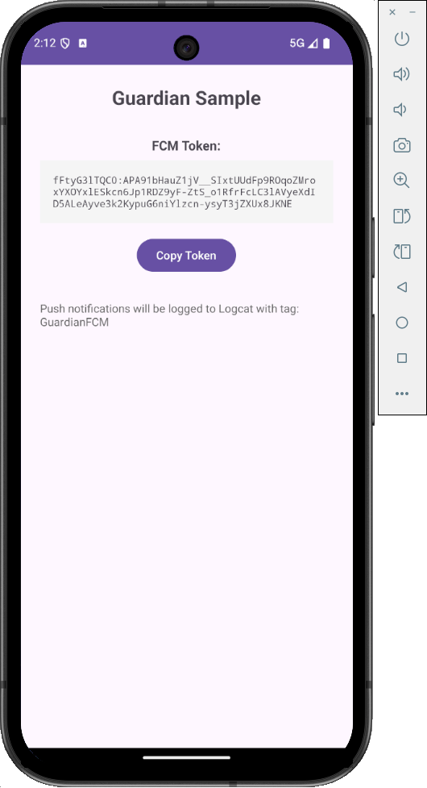
8. Get your FCM token from:
    - The app UI (tap "Copy Token"), or
    - Logcat: `adb logcat -s GuardianFCM` OR `make log`
9. Use the token with enrollment:
    ```shell
   cd ..
   ./enroll-device.sh -d domain -i bash01 -n bash01 -g <fcm-token> -t <enrollment_tx_id> 
   ```
10. When Guardian sends a push, check logcat for:
    D/GuardianFCM: === GUARDIAN PUSH NOTIFICATION ===
    D/GuardianFCM: challenge: <value>
    D/GuardianFCM: txtkn: <value>

11. Resolve MFA
    ```shell
    ./resolve-transaction.sh -i bash01 -c <challenge> -t <token> ...
    ```

12. Fetch Rich Consent Data (for transactions with detailed context)
    ```shell
    # If the push notification includes a consent_id for rich authorization details:
    ./rich-consents.sh -c <consent_id> -t <txtkn> -d <domain> -i <device_id>

    # Extract specific fields using jq:
    ./rich-consents.sh -c <consent_id> -t <txtkn> -d <domain> -i <device_id> | jq '.requested_details'
    ```

# Guardian Push Notification Apple App
To get your app Mac Application listening for notifications, you need to configure three things in the Apple Developer Portal https://developer.apple.com/account: 
1. the App ID, 
2. the Auth Key, and 
3. your Team ID.


Here is the step-by-step checklist to get those assets.

## 1. Register the App ID (The "Identity")
APNs needs to know which specific app is allowed to receive notifications.

1. Go to Certificates, Identifiers & Profiles > Identifiers.
2. Click the **plus (+)** button to create a new Identifier.
3. Select **App IDs** and click Continue.
4. Select **App** (not App Clip) and click Continue.
5. Description: Something like "Push Listener App".
6. Bundle ID: Select Explicit and enter the exact ID you used in your `Info.plist` (e.g., `com.auth0.guardian.PushListener`).
7. Capabilities: Scroll down the list and check the box for **Push Notifications**.
8. Click Continue, then Register.

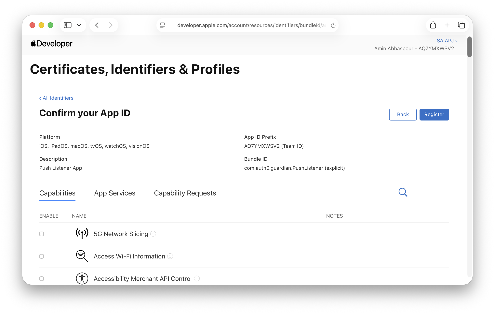

## 3. Create a Certificate Signing Request (CSR) form your Mac

1. Open Keychain Access
2. In the top menu bar, go to **Keychain Access > Certificate Assistant > Request a Certificate From a Certificate Authority...**
3. Fill in the Details:
    - User Email Address: Enter the email associated with your Apple Developer account.
    - Common Name: Enter a recognizable name (e.g., `PushListenerCSR`). This is just a label for you.
    - CA Email Address: Leave this empty.
    - Request is: Select Saved to disk.
4. Save the File: Click Continue and save the `.certSigningRequest` file to your Desktop.

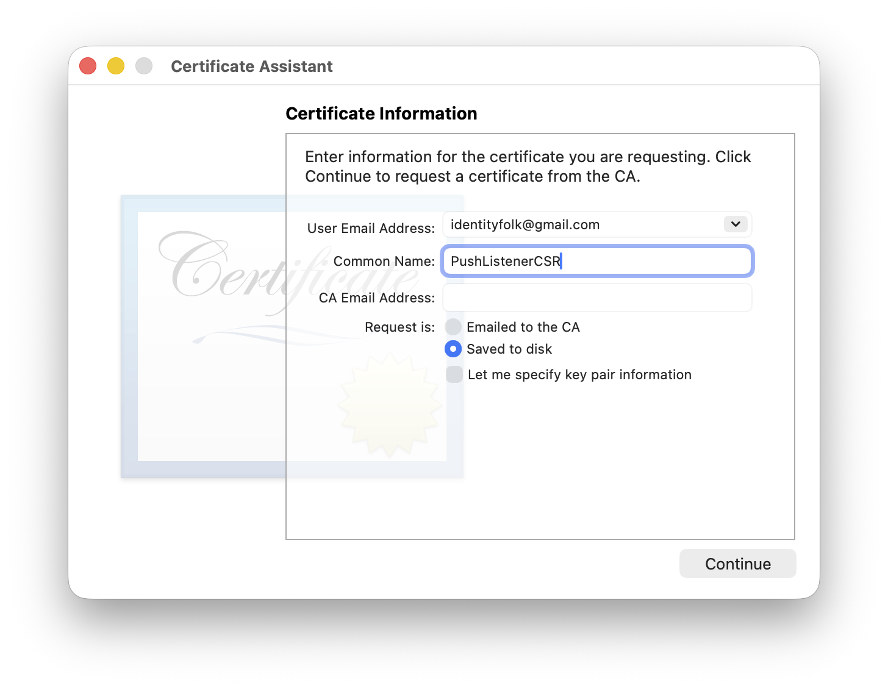

## 4. Create the APN Certificate
Unlike certificates that expire every year, an Auth Key (.p8 file) never expires and can be used for all your apps.

1. Go to **Certificates, Identifiers & Profiles > Certificates**.
2. Click the **plus (+)** button.
3. Under **Services** Select **Apple Push Notification service SSL (Sandbox & Production)** and click Continue.
4. Select the **App ID** (also known as Bundle ID) (e.g. `com.auth0.guardian.PushListener`) of your app and click Continue.
5. Select **CSR from step 3** and Continue.
6. Click **Download**


## 5. Export APN Certificate to .p12 Format 
1. Download the `.cer` file and double-click it to add it to your Keychain.
2. Right-click the certificate in Keychain Access and select **Export to get your Certificate.p12**.


## 6. Convert Certificate to Legacy Format
```shell
openssl pkcs12 -in Certificates.p12 -legacy -nocerts -nodes -out pk.pem -passin pass:"" 
openssl pkcs12 -in Certificates.p12 -legacy -nokeys -out cert.crt -passin pass:"" 
openssl pkcs12 -export -inkey pk.pem -in cert.crt -descert -out Certificate_3des.p12 -passout pass:"" 
rm pk.pem cert.crt
```

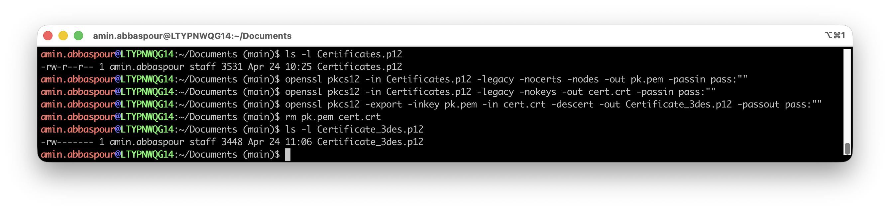

## 7. Find your Team ID
You need this to identify your account when sending the notification.

1. Go to the **Membership Details** section of your account.
2. Look for Team ID. It is a 10-character alphanumeric string (e.g., `9876543210`).

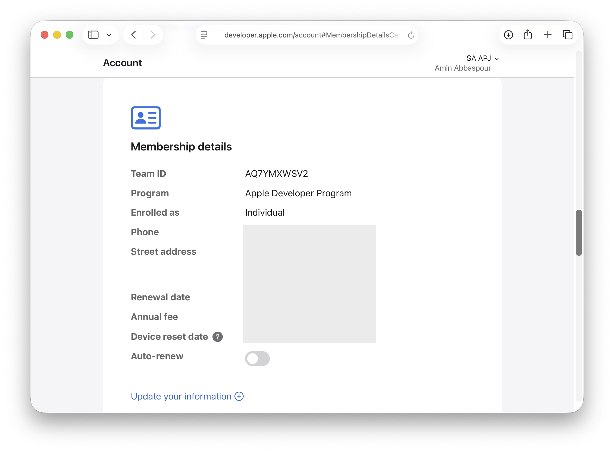

## 8. Enable APNS Push Notification in Auth0
1. Go to **Manage > Security > Multi-factor Auth > Push Notification Using Guardian**
2. Go to **iOS App Configuration** and **Enable iOS App**
3. **APNs Bundle ID** (e.g. `9876543210.com.auth0.guardian.PushListener`)
4. **APNs Certificate** upload `Certificate_3des.p12` file from step 6.
5. iOS App Environment choose according to your Certificate Type.
6. Click Save

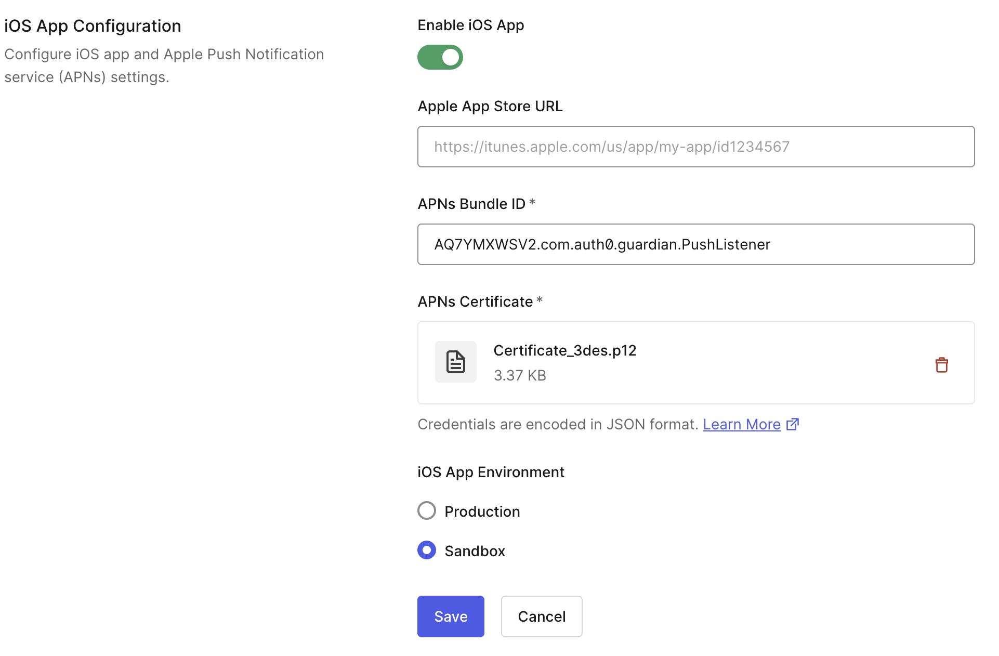

## 9. Apple Development Certificate - Required for Code Signing
In Apple developer website
1. Go to **Certificates, Identifiers & Profiles > Certificates**.
2. Click the **plus (+)** button.
3. Select **Apple Development** (This is the one used for testing apps locally) Click Continue.
4. Upload the `.certSigningRequest` file you saved to your desktop on step 3.
5. Click Continue, then Download the resulting `development.cer` file.

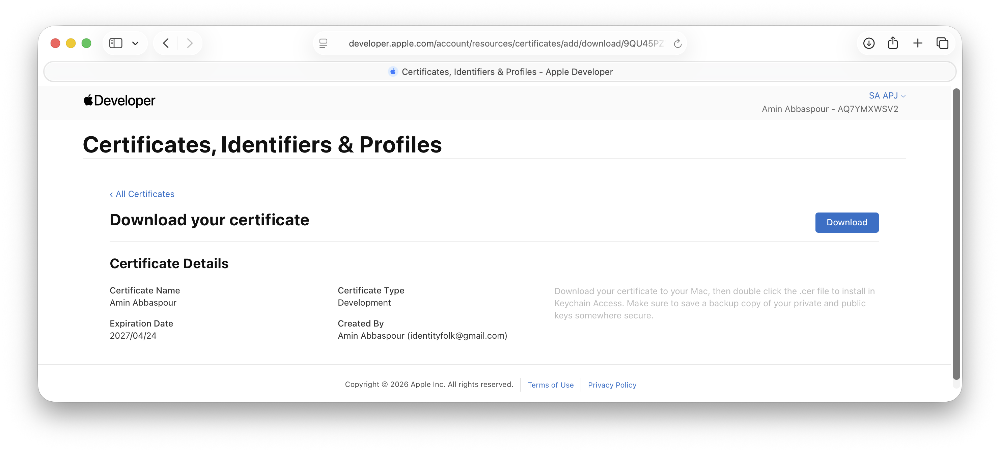

## 10. Install & Trust Development Certificate in your Keychain

1. Double-click the development.cer file you just downloaded.
2. Keychain Access will open. Ensure it is being added to the login keychain.
3. Set Trust to **"Use System Default"**
4. If Cert is not trusted, install Chain. E.g. Apple Worldwide Developer Relations Certification Authority G3
5. Apple certs are accessible from Apple PKI site https://www.apple.com/certificateauthority/ 

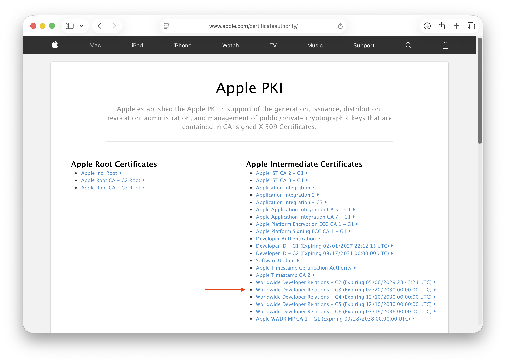

## 11. Register your Mac as a Development Device

macOS provisioning profiles require your Mac to be explicitly registered in the Developer Portal.

1. Find your Mac's Provisioning UDID:
   ```shell
   system_profiler SPHardwareDataType | grep "Provisioning UDID"
   ```
   If nothing is returned (older macOS), use Hardware UUID instead:
   ```shell
   system_profiler SPHardwareDataType | grep "Hardware UUID"
   ```
   > Use **Provisioning UDID** over Hardware UUID when both are present — the portal expects Provisioning UDID for Apple Silicon Macs.

2. Go to **Certificates, Identifiers & Profiles → Devices → +**
3. Platform: **macOS**
4. Device Name: any label (e.g. "My MacBook")
5. Device ID: paste the UDID from step 1
6. Click Continue → Register

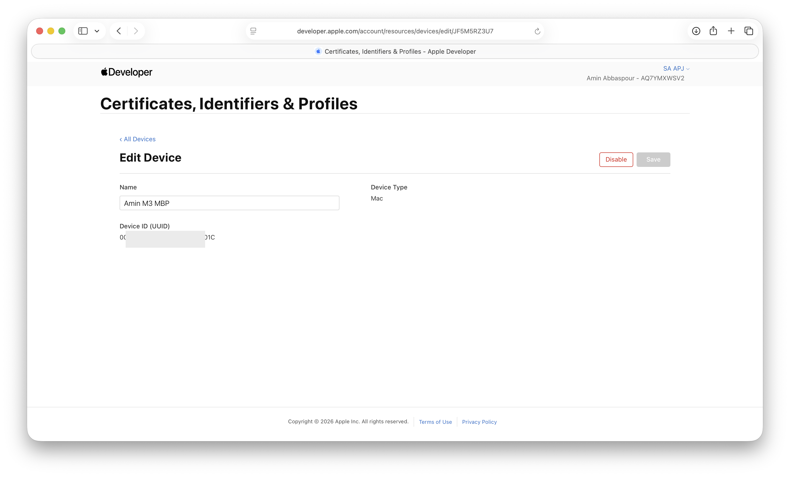

## 12. Create and Embed a macOS Provisioning Profile

The app must have an embedded provisioning profile so macOS can verify that your certificate is authorized to use the APNS entitlement. Without it the OS will reject the app at launch.

1. Go to **Certificates, Identifiers & Profiles → Profiles → +**
2. Select **macOS App Development** → Continue
3. App ID: **com.auth0.guardian.PushListener** → Continue
4. Select your development certificate → Continue
5. Select your Mac (registered in step 11) → Continue
6. Name it (e.g. "PushListenerDev") → Generate → Download
7. Copy the downloaded profile into the app bundle:
   ```shell
   cp ~/Downloads/PushListenerDev.mobileprovision \
     apns/PushListenerApp.app/Contents/embedded.provisionprofile
   ```

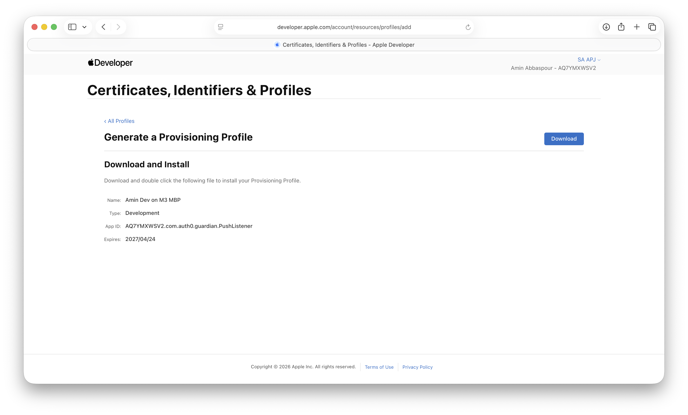

## 13. Sign Sample Code
1. Check Developer Cert is Trusted
2. Obtain your **Member ID**
3. Update `Makefile` in `apns/` folder with your `NAME` and `MEMBER_ID`
4. Run `make compile && make sign`

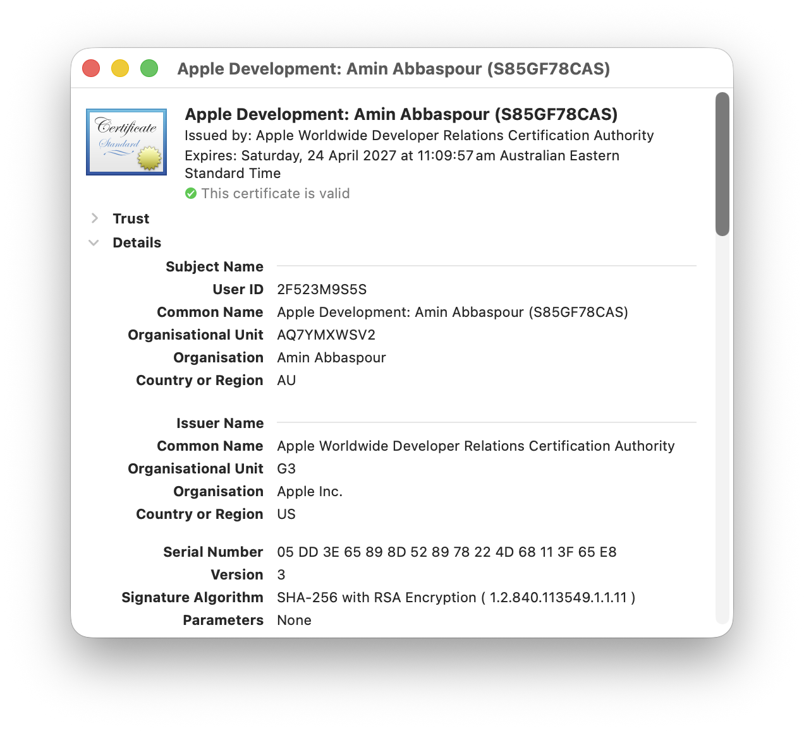


## 14. Notification Permission
Go to Apple's **System Settings > Notifications > Allow notifications** for PushListener app. 

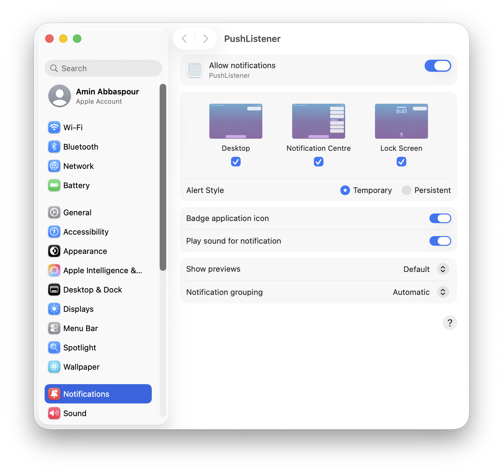

# Demo Video
[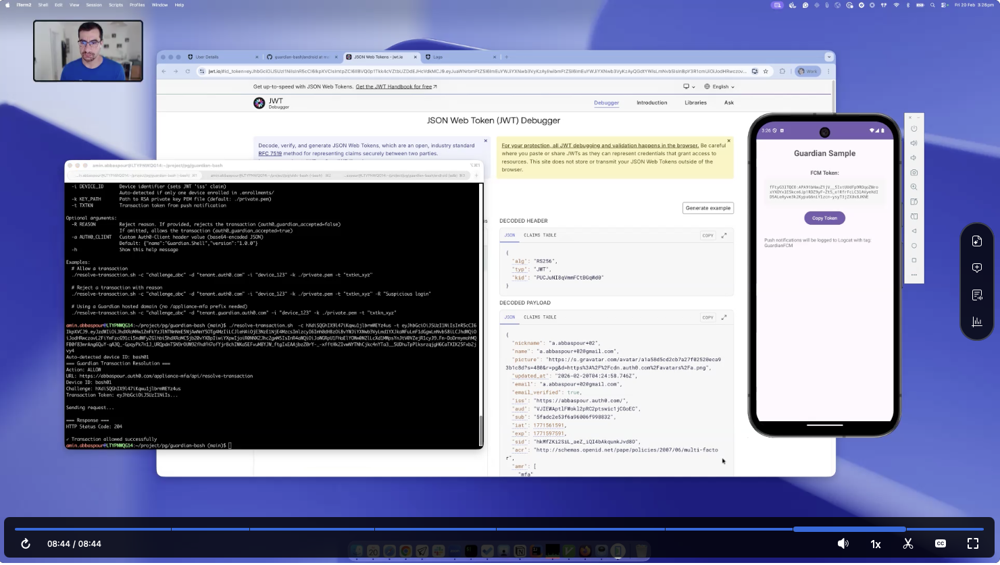](https://zoom.us/clips/share/-pcOp_IQTyCwCLCw9kaDoA)

# Related Content
* https://github.com/zamd/auth0-android-authenticator 
